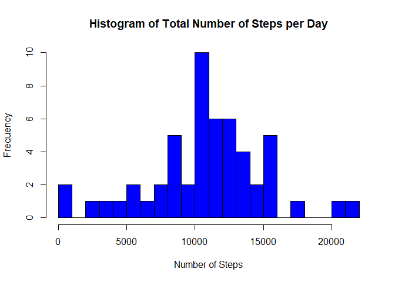
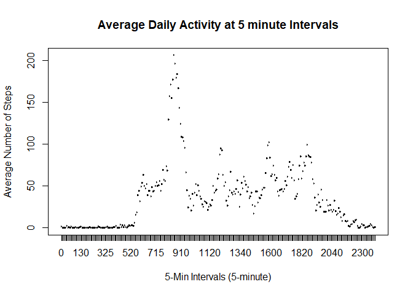
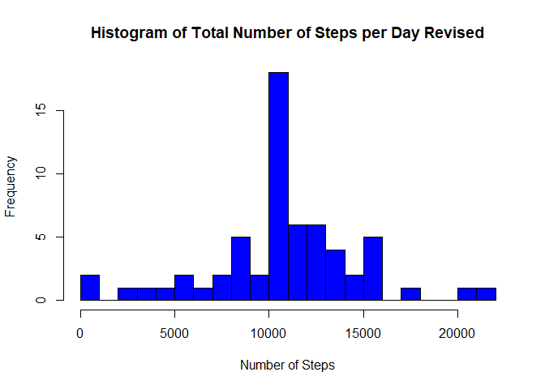
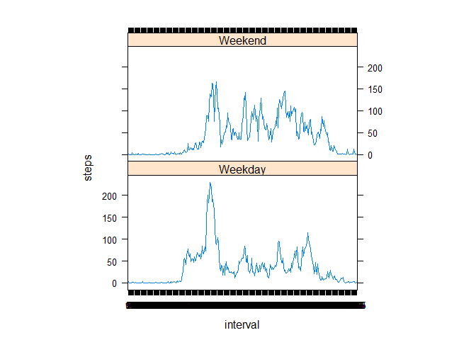

About Assignment
----------------

This project makes use of data from a personal activity monitoring device. This device collects data at 5 minute intervals through out the day. The data consists of two months of data from an anonymous individual collected during the months of October and November, 2012 and include the number of steps taken in 5 minute intervals each day. The goal of this project is to write a report that answers the questions detailed below.

Loading the Data
----------------

``` r
data <- read.csv("activity.csv", header = TRUE, sep = ",", na.strings = "NA")
```

#### Let's see what the data looks like using the head():

``` r
head(data)
```

    ##   steps       date interval
    ## 1    NA 2012-10-01        0
    ## 2    NA 2012-10-01        5
    ## 3    NA 2012-10-01       10
    ## 4    NA 2012-10-01       15
    ## 5    NA 2012-10-01       20
    ## 6    NA 2012-10-01       25

#### Also, let's look at some summary statistics

For example, using the summary():

``` r
summary(data)
```

    ##      steps                date          interval     
    ##  Min.   :  0.00   2012-10-01:  288   Min.   :   0.0  
    ##  1st Qu.:  0.00   2012-10-02:  288   1st Qu.: 588.8  
    ##  Median :  0.00   2012-10-03:  288   Median :1177.5  
    ##  Mean   : 37.38   2012-10-04:  288   Mean   :1177.5  
    ##  3rd Qu.: 12.00   2012-10-05:  288   3rd Qu.:1766.2  
    ##  Max.   :806.00   2012-10-06:  288   Max.   :2355.0  
    ##  NA's   :2304     (Other)   :15840

Preproccessing
--------------

Before we get to the main question, we need to do a little bit of preprocessing. It is useful to use the str() to get quick information about the structure of the data frame including the class of each variable.

``` r
str(data)
```

    ## 'data.frame':    17568 obs. of  3 variables:
    ##  $ steps   : int  NA NA NA NA NA NA NA NA NA NA ...
    ##  $ date    : Factor w/ 61 levels "2012-10-01","2012-10-02",..: 1 1 1 1 1 1 1 1 1 1 ...
    ##  $ interval: int  0 5 10 15 20 25 30 35 40 45 ...

We see that we have to convert 'date' variable to Date classes and 'interval' to a factor.

``` r
data$date <- as.Date(data$date, format = "%Y-%m-%d")
data$interval <- factor(data$interval)
```

Lastly, we can remove the missing values from 'steps' variable here in preprocessing or later.

``` r
NA_index <- is.na(as.character(data$steps))
df<- data[!NA_index,]
head(df)
```

    ##     steps       date interval
    ## 289     0 2012-10-02        0
    ## 290     0 2012-10-02        5
    ## 291     0 2012-10-02       10
    ## 292     0 2012-10-02       15
    ## 293     0 2012-10-02       20
    ## 294     0 2012-10-02       25

Now we are ready to answer the main questions.

Questions
---------

#### Question 1: What is mean total number of steps taken per day?

``` r
#notice you can remove NA's here as well
totalSteps <- aggregate(steps ~ date, data = df, sum, na.rm = TRUE)
```

First, we make a histogram:

``` r
hist(as.numeric(totalSteps$steps), breaks = 20, col = "blue", xlab = "Number of Steps", main= "Histogram of Total Number of Steps per Day")
```



Then, calculate mean and median:

``` r
mean(totalSteps$steps)
```

    ## [1] 10766.19

``` r
median(totalSteps$steps)
```

    ## [1] 10765

``` r
summary(totalSteps$steps)
```

    ##    Min. 1st Qu.  Median    Mean 3rd Qu.    Max. 
    ##      41    8841   10765   10766   13294   21194

#### Question 2: What is the average daily activity pattern?

We can use aggregrate function with mean to calculate average across recorded intervals:

``` r
steps_interval <- aggregate(steps ~ interval, data = df, mean, na.rm = TRUE)
```

Let's see how it looks when plotted:

``` r
plot(steps ~ interval, data = steps_interval, type = "p", xlab = "5-Min Intervals (5-minute)", ylab = "Average Number of Steps", main = "Average Daily Activity at 5 minute Intervals",  col = "blue")
```



#### Question 3: How could we control for bias caused by removing missing values?

The presence of missing days may introduce bias into some calculations or summaries of the data. We need to devise a strategy for filling in all of the missing values in the dataset. One way is to fill it in with the mean/median for the day or the 5-min interval. Here I will take the mean for 5-min intervals.

Let's start by calculating total number of missing values per variable.

Steps:

``` r
sum(is.na(as.character(data$steps)))
```

    ## [1] 2304

Date:

``` r
sum(is.na(as.character(data$date)))
```

    ## [1] 0

Interval:

``` r
sum(is.na(as.character(data$interval)))
```

    ## [1] 0

We see that we are only missing from 'steps' variable, a total of 2304 values.

Next, we need to take the mean so we can fill it in the NAs. Below I am using the dplyr library(need to be installed if you do not have it yet) to conveniently group the interval step values and taking the mean:

``` r
library(dplyr)
```

    ## 
    ## Attaching package: 'dplyr'

    ## The following objects are masked from 'package:stats':
    ## 
    ##     filter, lag

    ## The following objects are masked from 'package:base':
    ## 
    ##     intersect, setdiff, setequal, union

``` r
mean_per_interval <- data %>% group_by(interval) %>%
      summarize(mean.steps = mean(steps, na.rm = T))
```

Then, we prepare a copy of exiting data:

``` r
fill_data <- data
```

Now, the filling part:

``` r
for (i in 1:nrow(fill_data)) {
      if (is.na(fill_data$steps[i])) {
            index <- fill_data$interval[i]
            value <- subset(mean_per_interval, interval==index)
            fill_data$steps[i] <- value$mean.steps
      }
}
head(fill_data)
```

    ##       steps       date interval
    ## 1 1.7169811 2012-10-01        0
    ## 2 0.3396226 2012-10-01        5
    ## 3 0.1320755 2012-10-01       10
    ## 4 0.1509434 2012-10-01       15
    ## 5 0.0754717 2012-10-01       20
    ## 6 2.0943396 2012-10-01       25

To confirm differences, let' make a new histogram with the newly created set 'fill\_data':

``` r
new_totalSteps <- aggregate(steps ~ date, data = fill_data, sum, na.rm = TRUE)
```

``` r
hist(as.numeric(new_totalSteps$steps), breaks = 20, col = "blue", xlab = "Number of Steps", main= "Histogram of Total Number of Steps per Day Revised")
```



For a quick look we can use the summary() on the two datasets: 1st with NA removed, and 2nd with NA filled:

``` r
summary(totalSteps$steps)
```

    ##    Min. 1st Qu.  Median    Mean 3rd Qu.    Max. 
    ##      41    8841   10765   10766   13294   21194

``` r
summary(new_totalSteps$steps)
```

    ##    Min. 1st Qu.  Median    Mean 3rd Qu.    Max. 
    ##      41    9819   10766   10766   12811   21194

The mean and median are pretty muchstay the same but we see some change in the 1st quartile.

#### Question 4: Are there differences in activity patterns between weekdays and weekends?

Let's start by distinguishing weekday & weekend by using weekdays():

``` r
#Creating a new variable 'day' to make a distinction
fill_data$day <- ifelse(weekdays(fill_data$date) %in% c("Saturday", "Sunday"), "Weekend", "Weekday")
```

Then we can use the lattice graphing tools to easily make a comparative graph for weekday vs. weekend.

``` r
steps_interval= aggregate(steps ~ interval + day, fill_data, mean, na.rm = TRUE )
library(lattice)
xyplot(steps ~ interval | factor(day), data = steps_interval, aspect = 1/2, 
       type = "l")
```


